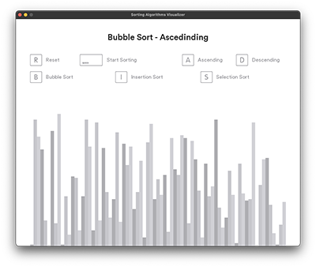
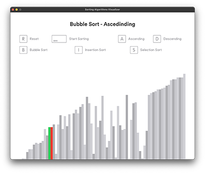

# Sorting Algorithms Visualizer

> App that visualizes basic algorithms for sorting arrays

[](https://forthebadge.com) [](https://forthebadge.com)

This project was created for learning purposes. The goal of this application is to illustrate how three basic sorting algorithms ([_Bubble Sort_](https://en.wikipedia.org/wiki/Bubble_sort), [_Insertion Sort_](https://en.wikipedia.org/wiki/Insertion_sort) and [_Selection Sort_](https://en.wikipedia.org/wiki/Selection_sort)) work.

 

## Technologies

This project was built with Python v3.10.2 and uses following technologies:

- [Pygame](https://www.pygame.org) (v2.1.2) - GUI for application
- [Pyinstaller](https://pyinstaller.org/en/stable/) (v5.8.0) - creates a folder with executable that users can immediately run without any extra installation

## How To Use

### Download

You can download the package with finished executable version of this application from [here](https://1drv.ms/u/s!AlGBPTpcrcFXig2AU6KeUbobtH4P?e=jhCNLU)
(select version for your operating system and save this folder to your compupter).

### Lauching the application

Enter the downloaded folder and run (double click) the file:

- macOS - `Sorter.app`
- Windows - `Sorter.exe`

## Development setup

Follow the steps below to get started with this project's development environment.

> _Note_: this instruction assumes you have python installed on your computer

1. Clone this repository and navigate into it.

```sh
$ git clone https://github.com/mattkepa/sorting-visualizer.git
$ cd sorting-visualizer
```

2. Create python virtual environment.

```sh
$ python -m venv .venv
```

3. Activate virtual environment.

- MacOS / Linux

```sh
$ source .venv/bin/activate
```

- Windows

```sh
$ .\.venv\Scripts\activate
```

4. Install project's dependecies.

```sh
$ pip install -r requirements.txt
```

5. Run app.

```sh
$ python main.py
```

## Inspiration

This app is based on [_Python Sorting Algorithm Visualizer Tutorial_](https://www.youtube.com/watch?v=twRidO-_vqQ) by [@Tech With Tim](https://www.youtube.com/@TechWithTim).

## License

All code is released under the [MIT](./LICENSE) License.
